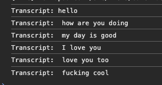
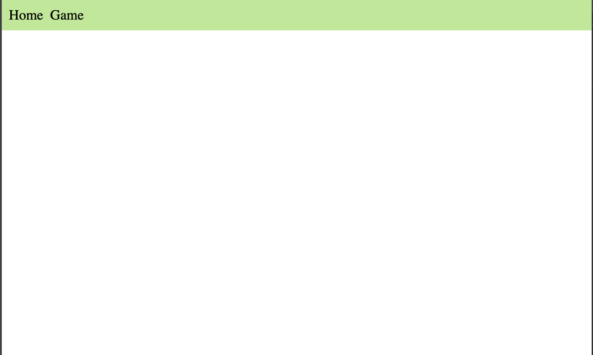
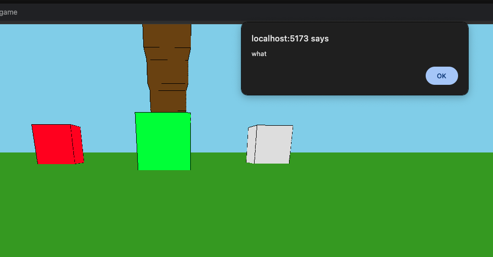
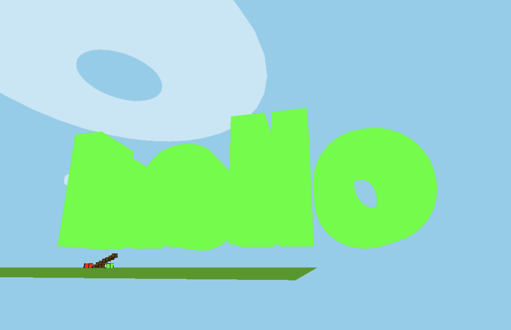

# This is my development journey

## 1. Installing three.js

I added three.js app with some objects in simple index.html. Did everything in a single file.

## 2. Adding game elements

I got the hang of the application and started working on many things: physics, collision detection, jumping, movement,
mouse controls and possibly other things. 

This caused the code to become bloated. Thus I had to separate it. I split it into multiple parts like
Character, Character movement, Environment, Assets, Menu. It gave the game some architectural outline.

Then I was informed that you cant do anything on mobile devices and ofcourse, because I only check keyboard and mouse.
I tried implementing the touch controls, but got stuck at just showing and closing the menu, because i 
did not even know how the controls would work. Like you have a single or double touch. Which one is looking around,
which one is walking around? 

But I learnt that i need to split input controls based on the users device

## Transcript

I thought that it would be cool to do things with my voice. 
I found MSDN transcript which is built in Chrome and many other browsers(NOT Firefox) and implemented it.

Here is my console log of a working transcript when I finally got it working:

## I got inspiration from Chris and created a Vue.js app. Game would only be one section of it

I got inspiration from Chris history and thought that it would be good idea to use vue.js application 
and make the game only one of the many pages that this application could have.
It would also be a lot easier to handle home page, profile edit, menus etc that way.

## What is the correct way to write vue?

I usually surf the internet for knowledge and how to do things. I check google, reddit, chatgpt. It mostly works.

Vue is the rare case where i am starting to use ONLY the vue.js official documentation, because anything
that is not documentation is mostly pure gibberish. It either does not work, looks like garbage or does things 
the wrong way. Trash articles come even from Medium or Stackoverflow questions. I am shocked how bad the vue.js
community information is. Docs are great tho.  

You might get lucky, but in most cases I am not. Different vue versions might have also caused this. 

Here is funny development moment. At some point i set the transcript to alert any speech transcribed and forgot about it.
There was silence for a long time, but then I ran into an issue that Escape event is not registered if it is related to
unlocking pointer and my expression was loud "what", which was reported to me and funny

## Visualizing transcribed text

I forwarded transcribed text to game. Then I had problems with drawing it, because fonts are a pain to deal with. 
After moving assets to a public map, i did it. I successfully created my first text.

It kind of dwarfed everything I had done before and almost reached the sky, but it was beatiful

