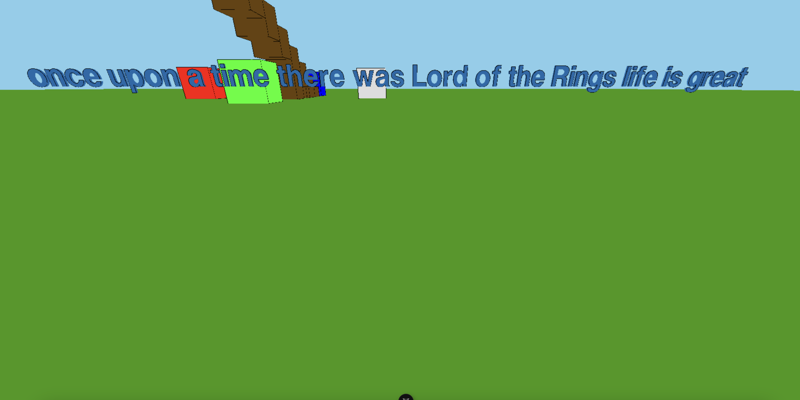

# This is my development journey

## 1. Installing three.js

I added three.js app with some objects in simple index.html. Did everything in a single file.

## 2. Adding game elements

I got the hang of the application and started working on many things: physics, collision detection, jumping, movement,
mouse controls and possibly other things. 

This caused the code to become bloated. Thus I had to separate it. I split it into multiple parts like
Character, Character movement, Environment, Assets, Menu. It gave the game some architectural outline.

Then I was informed that you cant do anything on mobile devices and ofcourse, because I only check keyboard and mouse.
I tried implementing the touch controls, but got stuck at just showing and closing the menu, because i 
did not even know how the controls would work. Like you have a single or double touch. Which one is looking around,
which one is walking around? 

But I learnt that i need to split input controls based on the users device

## Transcript

I thought that it would be cool to do things with my voice. 
I found MSDN transcript which is built in Chrome and many other browsers(NOT Firefox) and implemented it.

Here is my console log of a working transcript when I finally got it working:

## I got inspiration from Chris and created a Vue.js app. Game would only be one section of it

I got inspiration from Chris history and thought that it would be good idea to use vue.js application 
and make the game only one of the many pages that this application could have.
It would also be a lot easier to handle home page, profile edit, menus etc that way.

## What is the correct way to write vue?

I usually surf the internet for knowledge and how to do things. I check google, reddit, chatgpt. It mostly works.

Vue is the rare case where i am starting to use ONLY the vue.js official documentation, because anything
that is not documentation is mostly pure gibberish. It either does not work, looks like garbage or does things 
the wrong way. Trash articles come even from Medium or Stackoverflow questions. I am shocked how bad the vue.js
community information is. Docs are great tho.  

You might get lucky, but in most cases I am not. Different vue versions might have also caused this. 

Here is funny development moment. At some point i set the transcript to alert any speech transcribed and forgot about it.
There was silence for a long time, but then I ran into an issue that Escape event is not registered if it is related to
unlocking pointer and my expression was loud "what", which was reported to me and funny

## Visualizing transcribed text

I forwarded transcribed text to game. Then I had problems with drawing it, because fonts are a pain to deal with. 
After moving assets to a public map, i did it. I successfully created my first text.

It kind of dwarfed everything I had done before and almost reached the sky, but it was beatiful

## Shocking discovery that Web Speech API needs Wifi
I was testing my app if all is ok without internet and for a weird reason
the speech recognition was failing.

In reality, the Web Speech API CAN be local implementation or something supported 
by the operating system, but this all depends on Browsers preferences. 

Looks like Google Chrome has chosen to use their Google Speech API as the implementation.

In conclusion: Web Speech API is just API methods and Browser itself chooses how to implement them.

## Thinking of a command set

I created python notebook with example from: https://huggingface.co/docs/transformers/en/training

Ofcourse it did not work and there were quite a few problems, but in the end I succeeded. Some problems:
1. Python version. There were problems with python version as locally I had the latest version, but
some of the libraries for learning did not 

I was thinking of a dataset, did not search enough or there is not much, but also wanted to proceed
with my own dataset. Here is an example of the first dataset. Had to add just more data to be able to 
print and debug the training code.

## Testing the first model 

I created a really simple dataset with "create a blue cube" to be set to "create-cube blue" as "create-cube" command with "blue" color

I set input as "create a blue cube" and got output as "<pad><pad><pad>...."

It is a total failure. Now have to see what is going on. How is model responding like that.
Do i need to increase training amount, refactor data or even change the model to something else

## First success in accuracy

At first I did not understand what the output was. There was training_loss, validation_loss
What are those mystical things. Ok, they have a meaning, but no matter how big or small these
numbers were I did not get useful output, because in the end predictions were still
always just empty spaces and I was very confused. What is the model training for?

So I added "accuracy", which indicated how much of the answers did I actually get right?

And I was shocked - it was 0. 

I went and remade the testing data. I have multiple datasets in the datasets directory.
Currently using text_to_command_dataset_v1.csv.

I changed the command sets so that they would be understandable.

I generated 500 data points and increased the epoch count. 

I was finally rewarded with an accuracy that was 0.14 which is 14%. I am really happy,
because it is atleast something

Here are the cool images of it:

